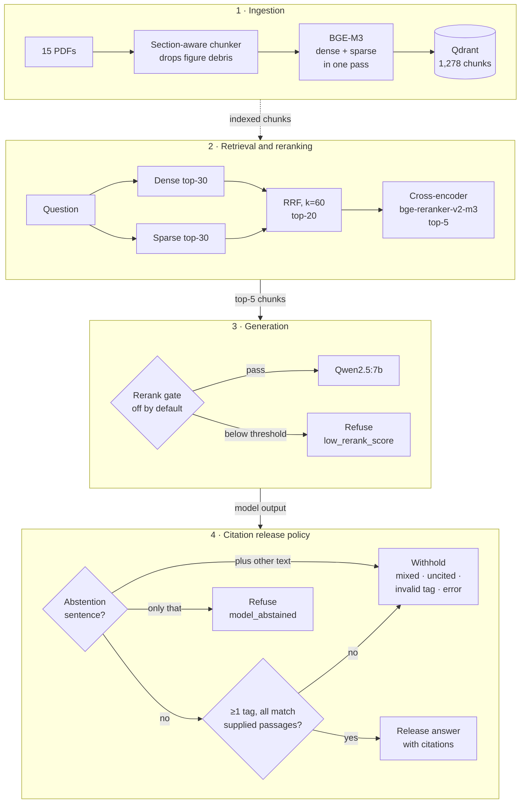

# Scholar RAG

**A citation-enforced RAG system for machine-learning papers, with a reproducible retrieval evaluation.**

Ask a question about 15 ML research papers. Scholar RAG retrieves evidence with hybrid search and a cross-encoder reranker, generates an answer with Qwen2.5:7b, and releases it only if its citations point to passages the model was actually given.

[](https://github.com/baranozgurtas/scholar-rag/actions/workflows/ci.yml)
[](https://www.python.org/)
[](https://fastapi.tiangolo.com/)
[](LICENSE)

- **Working RAG application.** A FastAPI service with a web UI. BGE-M3 dense and sparse retrieval are fused with RRF, a cross-encoder reranks the results, and Qwen2.5:7b answers from the top five chunks.
- **Evidence UI.** Each answer shows its retrieved chunks with dense, sparse and rerank scores. Citation pills jump to the cited chunk, and every refusal states its reason.
- **Citation release policy.** An answer is released only if it has at least one citation tag and every tag matches a supplied passage. Otherwise it is withheld and the outcome is recorded. This is a structural check: a matching tag shows the cited page was in the model's context, not that the passage supports the claim.
- **Reproducible A–D retrieval evaluation.** Dense, dense + rerank, hybrid, and hybrid + rerank are compared without loading the generator. Each run records its commit, models, index and question-file hash, and CI checks the harness without any models.

---

## Architecture



Every chunk carries `paper_title`, `page` and `section`. The prompt asks for a `[Paper: TITLE | p.N | §SECTION]` tag after each claim, and the same fields in parentheses are accepted under identical rules. The API response includes an `outcome` field explaining any refusal, and with `debug=true` it also returns the raw model output.

---

## Key engineering decisions

1. **Citations are a release condition, not decoration.** [`citation_checker.py`](src/rag/guards/citation_checker.py) accepts a tag only if it matches a supplied passage: exactly, with a different section on the same page, or with a whole-word shortened title of at least 6 characters. Uncited answers, out-of-context tags and refusal-plus-answer outputs are withheld.
2. **Retrieval is evaluated separately from generation.** The four-config ablation never loads the generator. The dense-only and dense+rerank configs share one candidate set, and the two hybrid configs share another, so the embedder and the reranker run in separate phases.
3. **Coverage is measured for multi-paper questions.** Hit@5 is satisfied by any one expected paper. All-sources@5 requires every expected paper in the five chunks the generator sees.
4. **Refusal is gated before generation only when evidence supports it.** The top-1 rerank-score gate is off by default. Its threshold can only be selected on the dev split, and recorded outputs let it be replayed exactly.
5. **Runs are reproducible and resumable.** Each run writes a manifest with the commit SHA, model names, generator digest, settings, PDF hashes, index size and question-file hash, and saves results one question at a time. It refuses to resume if the model or data changed.
6. **Index hygiene is enforced at ingestion.** A lexical-diversity filter drops PDF figure debris, such as scatter-plot markers extracted as text, which surfaced as the top dense results in one anomalous run ([incident write-up](docs/evaluation.md#index-hygiene-the-adam-question-returned-causal-forest-chunks-incident)).
7. **CI needs no models.** The suite runs a fake retriever, reranker and LLM, checks every evidence quote in the question set against the PDFs, and regenerates the historical results, all without torch, Ollama or a Qdrant server.

More rationale: [`docs/design_decisions.md`](docs/design_decisions.md).

---

## Evaluation results

### Finding: Hit@5 saturates, All-sources@5 exposes missing evidence

The A–D retrieval ablation ran on a 35-question set with fixed dev and held-out splits (25 answerable questions, 4 of them needing two papers, plus 10 unanswerable). The run is [`retrieval_v2draft35_20260925T222828Z_f416193`](eval/results/runs/retrieval_v2draft35_20260925T222828Z_f416193/); the questions are in [`eval/questions_v2_draft.jsonl`](eval/questions_v2_draft.jsonl).

| Config | Retrieval | Hit@5 (dev / held-out) | All-sources@5 dev (of 11) | All-sources@5 held-out (of 14) | MRR@10 held-out | nDCG@10 held-out | Latency p50 / p95, held-out (s) |
|---|---|---|---|---|---|---|---|
| A | Dense | 1.000 / 1.000 | 10/11 | 14/14 | 1.000 | 0.991 | 0.30 / 0.41 |
| B | Dense + rerank | 1.000 / 1.000 | 10/11 | 13/14 | 1.000 | 0.974 | 10.78 / 13.49 |
| C | Hybrid (RRF) | 1.000 / 1.000 | 10/11 | 13/14 | 0.952 | 0.949 | 0.75 / 1.00 |
| D | Hybrid + rerank (API default) | 1.000 / 1.000 | 10/11 | 13/14 | 1.000 | 0.962 | 14.82 / 23.77 |

MRR@10, nDCG@10 and latency are for held-out answerable questions. Latency is retrieval plus reranking per question, measured in the evaluation run.

- **Hit@5 cannot separate the configurations.** Each one placed at least one correct paper in the generator's top five for every answerable question.
- **All-sources@5 can.** It requires every expected paper in those five chunks, and it exposed evidence missing from multi-paper questions:
  - **D05** (BPR vs NCF): no configuration placed NCF in the top five.
  - **H13** (DeepAR and conformalized quantile regression): only dense-only placed DeepAR in the top five.
- **For comparison questions, Hit@5 overstates retrieval quality.** The harness therefore reports All-sources@5 alongside it and lists `missing_required_source_at_5` per question.

These are retrieval measurements. They do not rank the configurations overall or measure answer quality. The question set was drafted by an LLM and has not been human-reviewed, and its outcomes have been inspected, so the results are exploratory. Per-split tables, latency, per-question failures and the generation-evaluation status are in [docs/evaluation.md](docs/evaluation.md#exploratory-35-question-retrieval-run).

### Historical results (legacy 25-question set)

An earlier end-to-end run on 20 LLM-generated answerable questions and 5 off-topic questions, before the citation policy existed. Re-derived from the committed JSONs by `python -m eval.reanalyze_legacy` and checked in CI. Only five ranks were stored, so ranking metrics are @5. See [`legacy_reanalysis.md`](eval/results/legacy_reanalysis.md) for caveats.

<details>
<summary>Historical results table (4 configurations, legacy 25-question set)</summary>

<!-- METRICS:ABLATION:START -->
| Config | Hit@5 | MRR@5 | nDCG@5 | False abstention (answerable) | Answered unanswerable | p50 / p95 latency (s) |
|---|---|---|---|---|---|---|
| `A_dense_only` Dense only | 0.950 | 0.925 | 0.932 | 3/20 | 0/5 | 5.7 / 8.9 |
| `B_dense_plus_rerank` Dense + rerank | 1.000 | **0.967** | 0.975 | 1/20 | 0/5 | 6.6 / 9.8 |
| `C_hybrid_no_rerank` Hybrid (RRF), no rerank | 0.950 | 0.950 | 0.950 | 3/20 | 0/5 | 5.6 / 9.3 |
| `D_hybrid_plus_rerank` Hybrid + rerank (API default) | 0.950 | 0.950 | 0.950 | 0/20 | 0/5 | 6.8 / 10.3 |
<!-- METRICS:ABLATION:END -->

</details>

---

## Stack

| Layer | Choice |
|---|---|
| Generator | Qwen2.5:7b, self-hosted via Ollama |
| Embeddings | BAAI/bge-m3 (1024-dim dense + sparse) |
| Reranker | BAAI/bge-reranker-v2-m3 (cross-encoder) |
| Vector store | Qdrant, named dense + sparse vectors (server, or embedded via `QDRANT_PATH`) |
| Fusion | Reciprocal Rank Fusion, k=60 |
| Orchestration | LangChain core (LCEL) |
| API and UI | FastAPI + Uvicorn; vanilla HTML/CSS/JS served as static files |
| Observability | Prometheus metrics, structlog JSON logs, optional Langfuse tracing |
| Quality | pytest (deterministic), ruff, GitHub Actions |
| Packaging | Docker Compose (dev and prod) |

---

## Quickstart

Requires Python 3.11, [Ollama](https://ollama.com/), and Docker (or `QDRANT_PATH` for embedded Qdrant).

```bash
git clone https://github.com/baranozgurtas/scholar-rag.git
cd scholar-rag
python3.11 -m venv .venv && source .venv/bin/activate
pip install -r requirements-dev.txt && pip install -e .

ollama pull qwen2.5:7b
cp .env.example .env              # models, devices, QDRANT_URL or QDRANT_PATH
make services-up                  # Qdrant + Langfuse (skip when using QDRANT_PATH)
python -m rag.ingestion.pipeline --pdf-dir ./data/pdfs --recreate

make api                          # FastAPI + UI on http://localhost:8000
```

Evaluation:

```bash
make test                         # deterministic suite, no models needed
make eval-retrieval-draft         # retrieval-only ablation on the 35-question draft set
make eval-generation RUN=<run>    # generation for one config, resumable
```

All commands are listed in [docs/evaluation.md](docs/evaluation.md#commands).

---

## Question sets

- [`eval/questions_v2_draft.jsonl`](eval/questions_v2_draft.jsonl) has 35 questions on fixed dev and held-out splits: 25 answerable (4 need two papers) and 10 unanswerable, one with a false premise. Thirteen are harder items that do not name their target paper and have close distractors. CI verifies every evidence quote against its PDF page and every "absent" term against the scoped papers. A human review packet is in [`eval/review/`](eval/review/questions_v2_draft_review.md).
- [`eval/questions.jsonl`](eval/questions.jsonl) is the historical 25-question set, annotated with known label issues.

---

## Project layout

```
scholar-rag/
├── src/rag/
│   ├── ingestion/        # PDF loader, section-aware chunker, debris filter, ingest pipeline
│   ├── embeddings/       # BGE-M3 wrapper (dense + sparse in one call)
│   ├── vectorstore/      # Qdrant (server or embedded)
│   ├── retrieval/        # dense, sparse, hybrid (RRF), reranker
│   ├── generation/       # prompts, AnswerGenerator, RAGChain
│   ├── guards/           # citation extraction, validation, answer policy
│   ├── observability/    # Prometheus metrics, token ledger, Langfuse tracer
│   └── api/              # FastAPI routes, dependencies, schemas
├── static/               # web UI
├── eval/                 # question sets, harness, runners, committed runs
├── tests/                # deterministic suite
├── docs/                 # architecture, design decisions, evaluation
└── data/pdfs/            # the 15 source papers
```

---

## License

[Apache 2.0](LICENSE). Model weights (Qwen2.5, BGE-M3, BGE-reranker-v2-m3) are covered by their own licenses; see [`NOTICE`](NOTICE).
