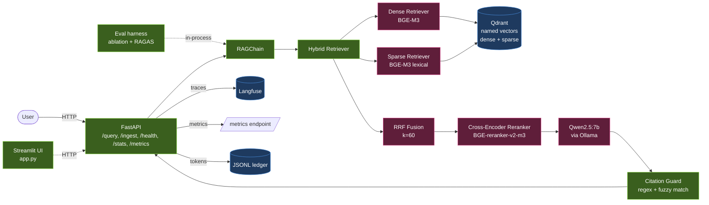
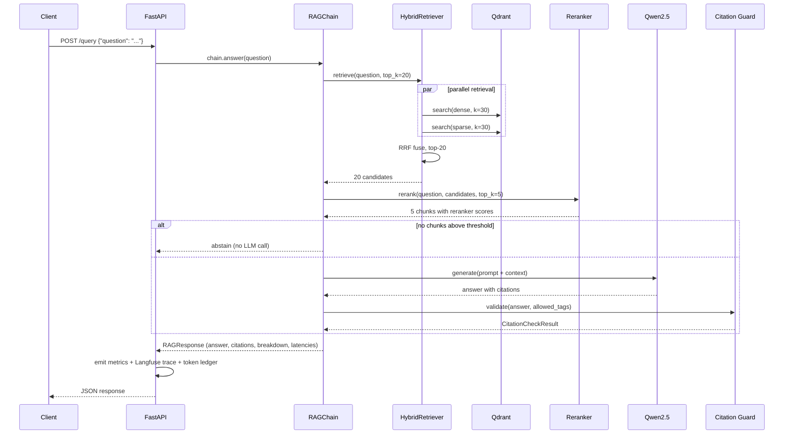
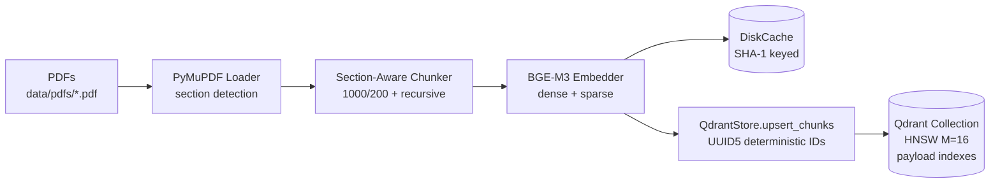
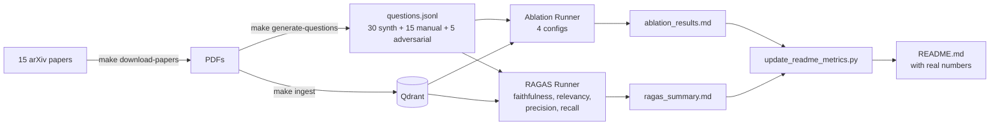

# Architecture

## High-level view



## Request lifecycle: `POST /query`



## Ingestion lifecycle



Key invariants:
- `file_hash` (MD5) attached to every chunk → identical PDFs are no-ops
- `chunk_id` = `{file_hash[:8]}_{seq:04d}` is deterministic → re-ingest
  is a clean overwrite, not duplicated
- Section boundaries are hard chunk boundaries → no chunk spans
  Abstract + Introduction

## Eval pipeline



## Data flow at the storage layer

Each Qdrant point has:

| Field | Type | Purpose |
|---|---|---|
| `id` | UUID5 from `chunk_id` | Stable identity for re-upsert |
| `vector["dense"]` | `float32[1024]` | BGE-M3 dense, L2-normalized |
| `vector["sparse"]` | sparse | BGE-M3 lexical weights |
| `payload.text` | str | The chunk text |
| `payload.source` | str | PDF filename (e.g., `bge-m3-chen-2024.pdf`) |
| `payload.file_hash` | keyword-indexed | Dedup + cascade delete |
| `payload.paper_title` | str | For citation tags |
| `payload.page` | int | Page number |
| `payload.section` | keyword-indexed | Section name (abstract/methods/etc.) |
| `payload.chunk_idx` | int-indexed | Position within paper |
| `payload.chunk_id` | str | Stable string ID `<hash>_<seq>` |

Payload indexes let us cheaply scroll a single paper, count chunks by
section, or filter retrieval to specific clusters (`section=results`)
without re-scanning the whole vector index.

## Concurrency model

- FastAPI routes are `async`. The blocking work (LLM generation,
  embedding, Qdrant search) is offloaded with `asyncio.to_thread`.
  The event loop stays responsive — concurrent `/query` requests
  are interleaved through the BGE / Ollama backends.
- BGE embedder + reranker hold their own internal threading via
  PyTorch. We never call them concurrently from multiple threads
  (FlagEmbedding is not fully reentrant on MPS).
- Qdrant client is thread-safe; multiple goroutines share one client.
- The `TokenLedger` and `LangfuseTracer` are thread-safe by design
  (lock for the ledger, queue for Langfuse).

## Configuration cascade

All runtime behavior flows from environment variables → Pydantic
Settings classes → injected into the code:

```
.env / process env
        │
        ▼
Settings (rag.config.Settings)
        │
        ├── LLMSettings           → llm.py (Ollama URL, model)
        ├── EmbeddingSettings     → bge_embedder.py, reranker.py
        ├── VectorStoreSettings   → qdrant_store.py
        ├── RetrievalSettings     → hybrid_retriever.py, rag_chain.py
        ├── ChunkingSettings      → chunker.py
        ├── IngestionSettings     → pipeline.py
        ├── APISettings           → api/main.py
        ├── ObservabilitySettings → metrics.py, langfuse_tracer.py
        └── CacheSettings         → bge_embedder.py disk cache
```

`get_settings()` is `@lru_cache`-d so a single load per process; tests
override with `monkeypatch.setenv(...)` + `get_settings.cache_clear()`.
